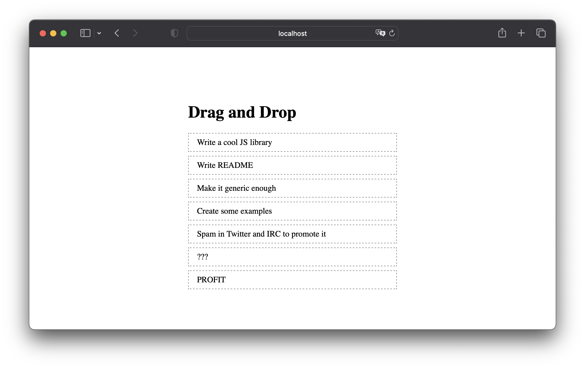

# React Dnd Example
> `vite-react-typescript-react-dnd`

This is a simple example of using React Dnd.



## Getting started
```bash
yarn install

yarn dev
```

Open [http://localhost:5173/](http://localhost:5173/) to view it in the browser.

